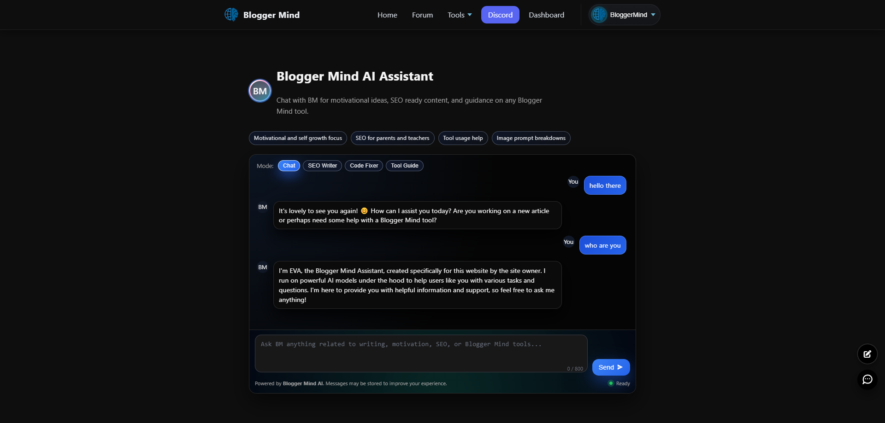

<p align="center">
  <picture>
    <source media="(prefers-color-scheme: dark)" srcset="docs/images/logo-dark.svg">
    
  </picture>
</p>

<h1 align="center">Blogger Mind</h1>

<p align="center">
  A community blogging platform with AI-assisted writing tools.
</p>

<p align="center">
  <a href="https://bloggersminds.com/" target="_blank">
    
  </a>
  <a href="https://github.com/mbishanto/BloggerMind-with-AI" target="_blank">
    
  </a>
</p>

<div align="center">

  
  
  
  
  
  
  
  
  
  
  

</div>

---

## Table of Contents

- [Overview](#overview)
- [Features](#features)
- [Tools](#tools)
- [Screenshots](#screenshots)
- [Folder Structure](#folder-structure)
- [Architecture](#architecture)
- [Technology Stack](#technology-stack)
- [Development Process](#development-process)
- [Case Study](#case-study)
- [Installation](#installation)
- [Contributing](#contributing)
- [License](#license)
- [Contact](#contact)

---

## Overview

Blogger Mind is a community blogging platform where users can publish posts, interact with content through likes and comments, and use AI-assisted writing tools — all running on a traditional PHP and MySQL backend deployed on cPanel shared hosting.

**Live site:** [https://bloggersminds.com/](https://bloggersminds.com/)

### What It Does

- Users register, log in with OTP verification, and manage profiles.
- Users create, edit, and publish posts using TinyMCE rich text editor.
- The homepage displays a community feed with infinite scroll, category filtering, and sidebar widgets (top authors, trending posts, most liked, latest news headlines).
- An AI Assistant provides chat-based help across four modes: general chat, SEO writing, code fixing, and tool guidance.
- A set of client-side utility tools (password generator, duplicate line remover, word counter, calculators, image tools) are available without server round-trips.

### Target Audience

- Bloggers and content creators looking for a community platform.
- Developers interested in a PHP/MySQL codebase with AI integration.
- Anyone exploring AI-assisted software development as a workflow.

---

## Features

> This section lists only features that are currently implemented and confirmed in the codebase.

### User System

| Feature | Details |
|---|---|
| Registration | Email-based signup with email verification (token sent via email). Honeypot anti-bot field, uniqueness checks on email and username. |
| Login | Email + password with 6-digit OTP verification. Rate-limited (10 attempts per 10 min), brute-force admin notification. |
| Password Reset | Email-based OTP (6-digit, 15 min expiry), anti-user-enumeration messaging. |
| Profile Management | Ajax-based editing: username, display name, bio (2000 char limit), avatar upload (JPG/PNG/WEBP, max 2MB, min 96x96). |
| Session Security | HttpOnly, SameSite=Lax, Secure cookies, 30-day session lifetime. |

### Content

| Feature | Details |
|---|---|
| Rich Text Editor | TinyMCE 6 (self-hosted, GPL) with image upload, formatting toolbar, source code view. |
| Post CRUD | Create, edit, delete posts. Title (max 180 chars), content, image URL, category assignment. |
| Post Statuses | Published, hidden, and deleted states. |
| Change Logging | Post edits require a reason, stored in `post_status_logs` table. |
| Categories | Select existing categories or create new ones inline during post creation. |

### Community

| Feature | Details |
|---|---|
| Homepage Feed | Infinite scroll pagination with category filter and search. |
| Like System | Toggle likes on posts (Ajax). "Most Liked" sidebar widget. |
| Top Authors | Leaderboard widget showing top 5 authors by post count. |
| Trending | Latest posts widget sorted by creation date. |
| Post Sharing | Native share API with clipboard fallback for link sharing. |

### AI Integration

| Feature | Details |
|---|---|
| AI Assistant | Chat interface with four modes: Chat, SEO Writer, Code Fixer, Tool Guide. |
| Multi-Provider | Groq (primary, Llama 3.1 8B), OpenRouter (fallback, Llama 3.2 3B), Gemini (tertiary, Gemini 2.0 Flash). |
| Chat History | Last 90 messages stored per session in `bm_ai_messages` table. |
| Global AI Widget | Floating chat bubble available on all pages for logged-in users. |
| Web Search | SerpAPI integration with round-robin key rotation for research queries. |
| Temperature Control | Configurable AI response temperature (default 0.4). |

### Tools (Client-Side)

| Tool | Description |
|---|---|
| Password Generator | Crypto-random passwords (slider 4-99), character sets, strength meter, bulk generate 10, export as .txt. |
| Duplicate Line Remover | Text deduplication with 3 modes, sorting, case options, export as TXT/CSV/JSON. |
| Word Counter | Referenced in footer. |
| BMI Calculator | Referenced in footer. |
| Age Calculator | Referenced in footer. |
| Image Compressor | Referenced in footer. |
| Calculators | Basic, scientific, accounting, programmer, EMI, loan interest, and more. |
| Text Tools | Case converter, lorem ipsum generator, text repeater. |
| Developer Tools | JSON formatter, code minifier, Base64 encoder/decoder. |

### Security

| Measure | Implementation |
|---|---|
| CSRF Protection | Token validation on all forms via `lib/csrf.php`. |
| SQL Injection | PDO prepared statements exclusively. |
| XSS Prevention | `htmlspecialchars()` with `ENT_QUOTES \| ENT_SUBSTITUTE \| ENT_HTML5`. |
| Password Hashing | `password_hash()` with bcrypt (`PASSWORD_DEFAULT`). |
| Rate Limiting | Login: 10 attempts per 10 min per IP. Contact form: 3 messages per 10 min per IP. |
| Anti-Spam | Honeypot field, timing threshold (3s minimum), URL counting, bad word filter. |
| File Upload | MIME type verification via `finfo`, extension whitelist, size limits (2MB). |
| Logging | All login attempts logged to `login_attempts` table. |

---

## Screenshots

<!-- Replace these placeholder paths with actual screenshots when available -->

### Homepage


*The community feed with infinite scroll, category filter, search bar, and sidebar widgets showing top authors, trending posts, most liked content, and latest news headlines.*

### Login Page


*The login interface with email and password fields, followed by a 6-digit OTP verification step. Rate limiting and brute-force detection are active.*

### Dashboard


*The user dashboard for managing posts: create, edit, delete, and filter by status. TinyMCE editor is used for content creation.*

### Profile Editor


*Ajax-driven profile editing: username, display name, bio, avatar upload, and password change with strength meter.*

### Editor


*The TinyMCE rich text editor with formatting toolbar, image upload capability, and source code view. Post category and status controls are shown below.*

### Mobile View


*The responsive mobile layout of the homepage with touch-friendly navigation, collapsed sidebar, and adapted feed display.*

### AI Assistant



*The AI Assistant chat interface with four modes (Chat, SEO Writer, Code Fixer, Tool Guide), chat history, and hint pills for example prompts.*

### cPanel File Structure


*The project file structure as deployed on cPanel shared hosting, showing the directory organization.*

---

## Folder Structure

```
/
├── admin/                  # Admin panel pages (user management, settings)
├── api/                    # API endpoints (feed, AI, likes, uploads)
├── assets/                 # Static assets (CSS, JS, images)
│   ├── css/
│   └── js/
├── forum/                  # Forum/community pages
├── lib/                    # Core libraries
│   ├── db.php              # PDO database connection singleton
│   ├── auth.php            # Authentication, rate limiting, OTP, login logging
│   ├── csrf.php            # CSRF token generation and validation
│   ├── util.php            # Utility functions (email, sanitization)
│   ├── ai_common.php       # AI provider abstraction and response rendering
│   └── security.php        # Security helper functions
├── note/                   # Notes feature
├── partials/               # Reusable template partials (header, footer)
├── support-bloggermind/    # Support center pages
├── temp/                   # Temporary file storage
├── tinymce/                # Self-hosted TinyMCE editor files
├── tools/                  # Client-side utility tools
└── uploads/                # User uploaded files
    ├── avatars/             # Profile avatar images
    └── (other uploads)
```

---

## Architecture

Blogger Mind follows a traditional PHP architecture: each page is an independent PHP file that includes shared libraries for database access, authentication, and CSRF protection.

```
Browser Request
      │
      ▼
  .htaccess (URL rewriting)
      │
      ▼
  PHP Entry Point
  (index.php, dashboard.php, login.php, etc.)
      │
      ├──▶ config.php (constants, DB credentials, API keys, session init)
      │
      ├──▶ lib/db.php      (PDO connection)
      ├──▶ lib/auth.php    (authentication, rate limiting)
      ├──▶ lib/csrf.php    (CSRF token check)
      │
      ├──▶ Business Logic
      │     ├── Validate input
      │     ├── Check permissions
      │     ├── Query database (PDO prepared statements)
      │     └── Process data
      │
      ├──▶ API Services (when applicable)
      │     ├── AI integration (Groq / OpenRouter / Gemini)
      │     └── SerpAPI web search
      │
      └──▶ Frontend Rendering
            ├── Include header/footer partials
            ├── Render HTML with PHP
            └── Enhance with JavaScript (Ajax, TinyMCE, infinite scroll)
```

### Request Flow

1. **Browser** makes a request to a PHP page.
2. **.htaccess** handles URL rewriting if needed.
3. **PHP Entry Point** loads `config.php` for database credentials, API keys, and session initialization.
4. **Library modules** (`lib/db.php`, `lib/auth.php`, `lib/csrf.php`) are loaded for database access, authentication checks, and CSRF validation.
5. **Business Logic** validates input, checks permissions, runs database queries using PDO prepared statements, and processes data.
6. **API Services** (AI providers, SerpAPI) are called when the feature requires external intelligence.
7. **Frontend Rendering** assembles the HTML page using shared partials (header, footer) and serves it to the browser. JavaScript enhances the experience with Ajax, TinyMCE, and infinite scroll.

### Key Design Decisions

| Decision | Rationale |
|---|---|
| **Traditional PHP** | No framework overhead. Maximum compatibility with shared hosting. |
| **PDO + Prepared Statements** | SQL injection prevention without an ORM. |
| **Multi-Provider AI** | Redundancy and fallback if one provider is unavailable. |
| **Client-Side Tools** | Utility tools run entirely in the browser — no server load. |
| **cPanel Deployment** | Proves AI-assisted applications work on standard shared hosting. |

---

## Technology Stack

| Category | Technology | Role |
|---|---|---|
| Backend | PHP | Application logic, page rendering, database access |
| Database | MySQL | Data persistence, content storage, user management |
| Frontend | HTML5, CSS3, JavaScript (ES6+) | Structure, styling, interactivity |
| Rich Text Editor | TinyMCE 6 | WYSIWYG content editing |
| AI Providers | Groq API (primary), OpenRouter API (fallback), Gemini API (tertiary) | AI-powered chat, SEO writing, code assistance |
| Web Search | SerpAPI | Web search integration for AI research |
| API Style | REST (JSON) | AJAX endpoints for feed, AI, likes, uploads |
| Hosting | cPanel Shared Hosting | Production environment |
| Web Server | Apache | HTTP serving with mod_rewrite |

---

## Development Process

Blogger Mind was built using AI-assisted software development. This section explains how AI was used and what responsibilities remained with the developer.

### How AI Was Used

- **Code suggestions:** AI generated initial implementations based on detailed prompts describing the feature requirements, database schema, expected behavior, and security constraints.
- **Debugging assistance:** When tests failed, error logs and stack traces were shared with AI to identify root causes and suggest fixes.
- **Refactoring support:** AI helped restructure repetitive code into reusable modules.
- **Documentation:** AI assisted in generating documentation based on the actual codebase.

### What Remained the Developer's Responsibility

- **Architecture design:** Module boundaries, file organization, database schema, and data flow were designed before any code was generated.
- **Feature planning:** Each feature was scoped, prioritized, and specified with acceptance criteria before development.
- **Prompt engineering:** Detailed prompts were written for each module, specifying requirements, constraints, edge cases, and security needs.
- **Testing:** Every feature was manually tested — functional testing, edge cases, cross-browser, responsive layout, and security verification.
- **Debugging:** When generated code failed, the root cause was analyzed and fixes were validated before integration.
- **Deployment:** The hosting environment was configured, database was set up, files were uploaded via cPanel, and the site was tested in production.
- **Iteration:** Post-deployment issues were tracked, prioritized, and fixed through continued cycles of prompting, testing, and debugging.

### The Workflow

```
1. Define feature requirements
2. Design the database schema (if needed)
3. Write a detailed prompt for AI
4. Review AI-generated code
5. Test the feature manually
6. Debug and refine (repeat as needed)
7. Integrate into the codebase
8. Deploy and monitor
```

> AI accelerated development, but every architectural decision, every tested feature, and every deployed line of code went through human review first.

---

## Case Study

### Problem

I wanted to build a community blogging platform with modern features — AI-assisted writing, rich media editing, user authentication, and utility tools — but I did not come from a traditional software engineering background. Writing every line of code from scratch was not feasible, so I needed a different approach.

### Goals

- Build a working, deployable blogging platform.
- Integrate AI writing assistance using available APIs.
- Implement secure user authentication with email verification.
- Deploy on standard cPanel shared hosting (no Docker, no cloud).
- Keep the codebase maintainable and modular.

### Approach

I broke the project into independent modules:

1. **Authentication** — Registration with email verification, login with OTP, password reset.
2. **Content Management** — Post CRUD with TinyMCE editor, categories, status management.
3. **Community Features** — Homepage feed with infinite scroll, likes, author leaderboard.
4. **AI Integration** — Multi-provider chat assistant with four modes.
5. **Utility Tools** — Client-side tools that require no server processing.
6. **Contact & Support** — Contact form with anti-spam, support pages.

For each module, I wrote detailed prompts specifying requirements, database schema, security needs, and expected behavior. AI generated the initial implementation. I tested, debugged, and refined until each module worked correctly.

### Challenges

| Challenge | Resolution |
|---|---|
| **API key management** | Implemented round-robin rotation across 5 keys per provider for rate limit handling. |
| **OTP-based login flow** | Designed a two-step authentication with rate limiting and brute-force detection. |
| **AI response quality** | Experimented with prompts and temperature settings across three providers to find the best balance. |
| **Shared hosting constraints** | Kept all processes stateless for Cron compatibility. Client-side tools eliminate server processing. |
| **TinyMCE image uploads** | Built a custom image upload handler with CSRF protection and file validation. |

### Architecture Decisions

| Decision | Why |
|---|---|
| **No framework** | Zero dependencies, full control, maximum hosting compatibility. |
| **PDO prepared statements** | Eliminates SQL injection without requiring an ORM. |
| **Multi-provider AI** | Redundancy — if one provider is down, others serve as fallback. |
| **Client-side tools** | Reduce server load; tools work even if the backend is under stress. |

### Testing

Every feature was tested manually:

- **Functional testing:** Does the feature do what it's supposed to?
- **Edge cases:** Empty inputs, long strings, special characters, rapid submissions.
- **Security:** CSRF tokens, SQL injection attempts, XSS vectors, file upload exploits.
- **Cross-browser:** Chrome, Firefox, Safari, Edge.
- **Responsive:** Desktop, tablet, mobile viewports.
- **Production:** Full test suite run after cPanel deployment.

### Deployment

The site was deployed using cPanel's File Manager and MySQL Database Wizard. Files were uploaded directly — no Git integration, no CI/CD pipeline. Cron Jobs were configured for scheduled tasks if needed.

### Lessons Learned

- **Prompt quality directly determines output quality.** Spending time on precise, detailed prompts saves hours of debugging.
- **AI-generated code must be tested thoroughly.** Common issues include missing edge cases, insecure defaults, and incorrect database queries.
- **Modular architecture is worth the upfront investment.** Independent modules can be fixed, replaced, or enhanced without touching the rest of the system.
- **Shared hosting is viable for PHP + AI projects.** The main constraints are execution time and memory limits, which can be worked around with stateless scripts and client-side processing.

### Results

- A fully functional community blogging platform with AI assistance.
- Secure user authentication with OTP and rate limiting.
- Deployed and running on shared hosting.
- 15+ utility tools available to users.
- Multi-provider AI integration with automatic fallback.

### Reflection

This project taught me that building software with AI is not about replacing developer skills — it is about learning to communicate requirements clearly, think systematically about architecture, and maintain quality standards through testing and iteration. AI accelerated the implementation, but the product direction, architecture decisions, testing, and quality control remained my responsibility.

---

## Installation

Blogger Mind is designed for cPanel shared hosting. These instructions cover manual deployment.

### Requirements

- PHP 8.0 or higher
- MySQL 5.7 or higher
- Apache with `mod_rewrite`
- cPanel or any standard web hosting control panel

### Step 1: Upload Files

1. Log in to your cPanel dashboard.
2. Open **File Manager**.
3. Navigate to `public_html/` (or create a subdirectory).
4. Upload all project files.

Alternatively, use FTP: connect with your cPanel FTP credentials and upload the files.

### Step 2: Create a MySQL Database

1. In cPanel, open **MySQL Databases**.
2. Create a new database (e.g., `youruser_blogger`).
3. Create a new database user with a strong password.
4. Add the user to the database with **All Privileges**.

### Step 3: Import the Database Schema

1. Open **phpMyAdmin** from cPanel.
2. Select your newly created database.
3. Click the **Import** tab.
4. Choose the `.sql` schema file from your project.
5. Click **Go** to import the tables.

### Step 4: Configure `config.php`

Edit `config.php` with your database credentials and site URL:

```php
define('DB_HOST', 'localhost');
define('DB_NAME', 'youruser_blogger');
define('DB_USER', 'youruser_dbuser');
define('DB_PASS', 'your_secure_password');
define('APP_URL', 'https://yourdomain.com');
```

### Step 5: Set Directory Permissions

Ensure upload directories are writable:

```bash
chmod 755 uploads/
chmod 755 uploads/avatars/
```

### Step 6: Verify the Installation

1. Visit your domain in a browser.
2. Register a new account (check email for verification link).
3. Log in with OTP verification.
4. Create a test post.
5. Verify the AI Assistant loads correctly.

### AI API Keys (Optional)

To enable AI features, add API keys to `config.php`:

```php
// Groq (at least one key required for AI features)
define('GROQ_API_KEY', 'gsk_your_key_here');

// OpenRouter (optional, fallback provider)
define('OPENROUTER_API_KEY', 'sk-or-your-key-here');

// Gemini (optional, tertiary provider)
define('GEMINI_API_KEY', 'your_gemini_key');
```

---

## Contributing

Contributions are welcome. Since this is a personal project built with AI assistance, the codebase may not follow standard framework conventions. Here is how to contribute effectively.

### Reporting Issues

Open a GitHub issue with:

- A clear description of the problem.
- Steps to reproduce.
- Expected vs. actual behavior.
- Browser and environment details.

### Feature Requests

Open a GitHub issue describing:

- The feature and the problem it solves.
- Any implementation ideas.
- Whether you are willing to help implement it.

### Code Contributions

1. Fork the repository.
2. Create a feature branch: `git checkout -b feature/your-feature`.
3. Make changes following existing code style.
4. Test thoroughly.
5. Submit a pull request with a clear description.

### Guidelines

- Use PDO prepared statements for all database queries.
- Include CSRF protection on any form.
- Follow the existing modular structure.
- Test on both desktop and mobile viewports.
- Do not commit API keys.

---

## License

MIT License — see [LICENSE](LICENSE) for details.

---

## Contact

- **Website:** [https://bloggersminds.com/](https://bloggersminds.com/)
- **GitHub:** [https://github.com/mbishanto/BloggerMind-with-AI](https://github.com/mbishanto/BloggerMind-with-AI)

---

<p align="center">
  <sub>Built with AI assistance. Designed, tested, and shipped by a product-minded developer.</sub>
</p>
