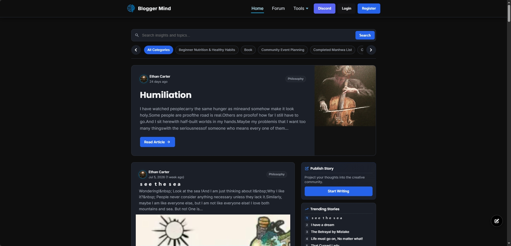
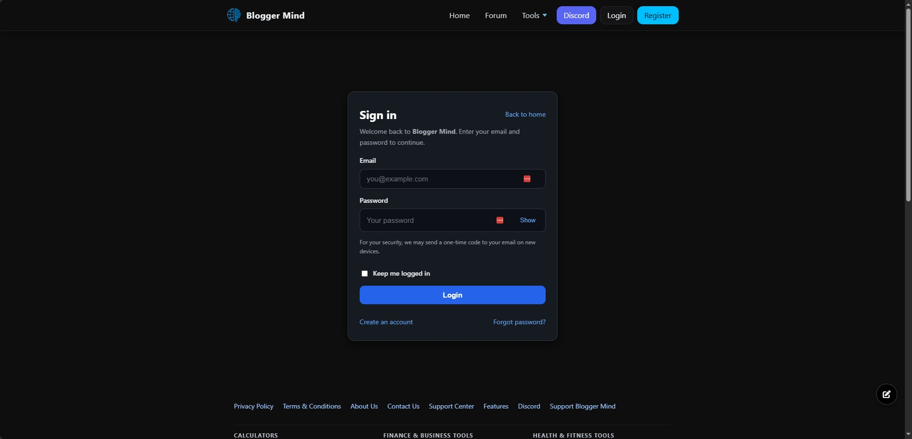
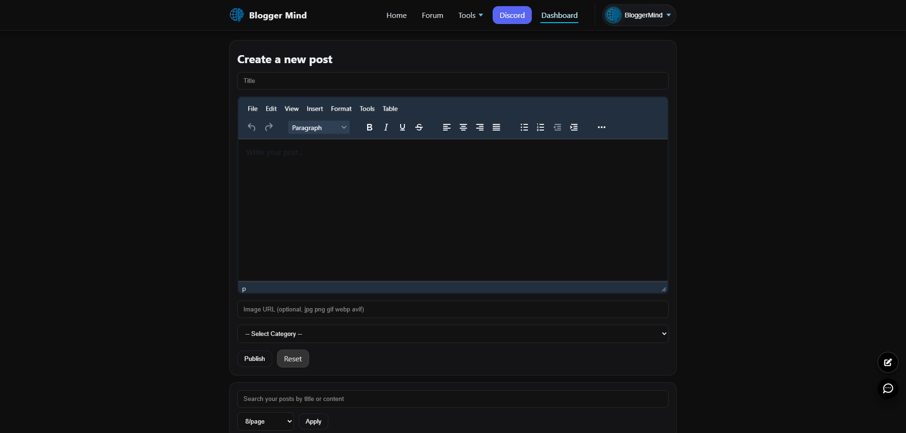
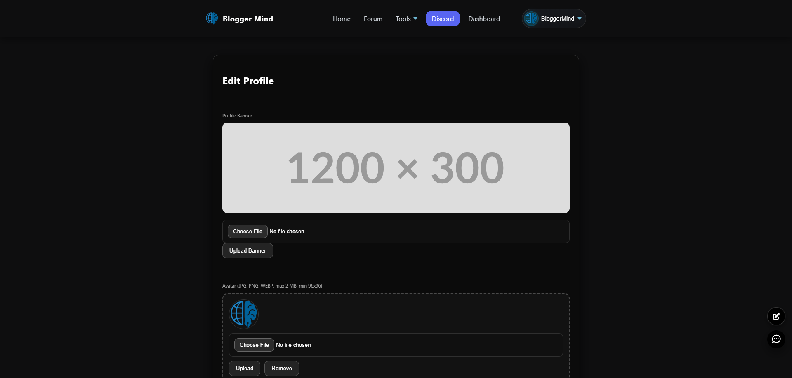
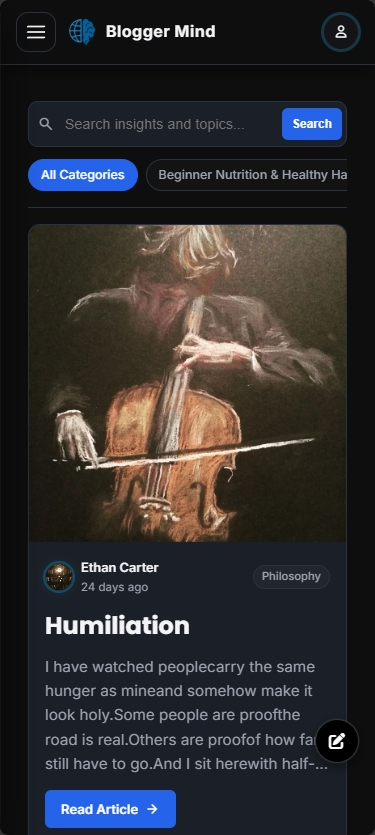
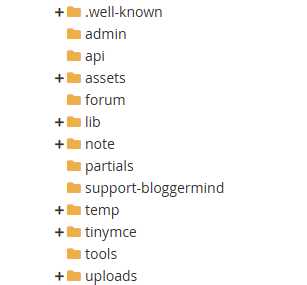

  <picture>
    <source media="(prefers-color-scheme: dark)" srcset="docs/images/logo-dark.svg">
    
  </picture>

<h1 align="center">Blogger Mind</h1>

  A community blogging platform with AI-assisted writing tools.

  
  

  
  
  
  
  
  
  
  
  
  

---

Blogger Mind is a community blogging platform where users publish posts, interact through likes, and access AI-assisted writing tools — built with PHP and MySQL, deployed on cPanel shared hosting.

**Live:** [https://bloggersminds.com/](https://bloggersminds.com/)

- Register, log in with OTP verification, manage your profile.
- Create posts using the TinyMCE rich text editor.
- Community feed with infinite scroll, likes, and sharing.
- AI Assistant with four modes: Chat, SEO Writer, Code Fixer, Tool Guide.
- 15+ client-side utility tools (password generator, duplicate line remover, calculators, image tools, text tools).
- Multi-provider AI integration (Groq, OpenRouter, Gemini) with automatic fallback and key rotation.

---

## Screenshots

| Homepage | Login | Dashboard |
|---|---|---|
|  |  |  |

| Profile | Mobile | cPanel |
|---|---|---|
|  |  |  |

---

## Tech Stack

| Category | Technology |
|---|---|
| Backend | PHP |
| Database | MySQL |
| Frontend | HTML5, CSS3, JavaScript |
| Editor | TinyMCE 6 |
| AI Providers | Groq, OpenRouter, Gemini |
| Web Search | SerpAPI |
| Hosting | cPanel Shared Hosting |

---

## Documentation

| Page | Description |
|---|---|
| [Overview](docs/overview.md) | What Blogger Mind is and what it does |
| [Features](docs/features.md) | Complete feature list (current + planned) |
| [Architecture](docs/architecture.md) | System design, request flow, database schema |
| [Tech Stack](docs/tech-stack.md) | Languages, libraries, services |
| [Development Process](docs/development-process.md) | How AI-assisted development was used |
| [Security](docs/security.md) | Authentication, CSRF, SQL injection prevention |
| [Installation](docs/installation.md) | Requirements and setup steps |
| [Deployment](docs/deployment.md) | cPanel deployment guide |
| [Roadmap](docs/roadmap.md) | Planned features and improvements |
| [FAQ](docs/faq.md) | Frequently asked questions |
| [Case Study: Blogger Mind](docs/case-study-bloggermind.md) | Engineering portfolio case study |
| [Case Study: Building with AI](docs/case-study-building-with-ai.md) | AI-assisted development journey |
| [FlyRank Case Study](docs/flyrank-case-study.md) | FlyRank submission |
| [Screenshots](docs/screenshots.md) | Visual walkthrough |
| [Contributing](docs/contributing.md) | How to contribute |

---

## License

MIT License — see [LICENSE](LICENSE).

---

## Contact

- Website: [https://bloggersminds.com/](https://bloggersminds.com/)
- GitHub: [https://github.com/mbishanto/BloggerMind-with-AI](https://github.com/mbishanto/BloggerMind-with-AI)
